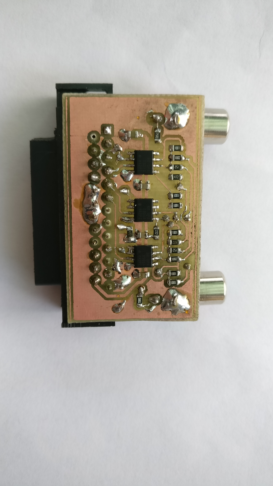
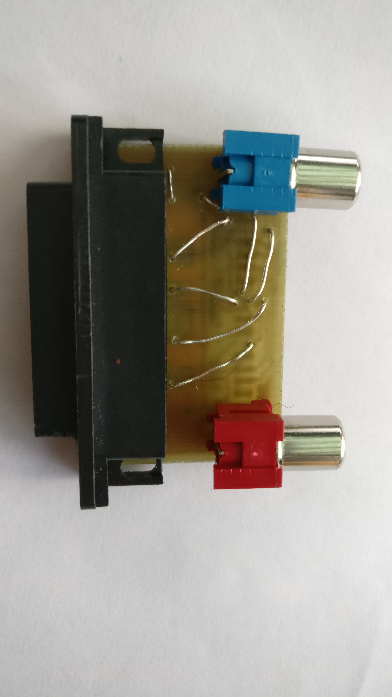

# Amiga YPbPr Adapter

To get the best possible image quality from a vintage Amiga (specifically Amiga 500) home computer.

The Amiga basically supports RGB output natively, but this standard is not suitable to directly
feed into a modern mid-range TV. The way to go with current TVs is component video (a.k.a YPbPr) that
has basically the same quality as RGB but uses a different way to encode everything.

As a matter of fact, the Y of YPbPr is just the (monochrome) luma signal together with sync, which is 
identical to the signal many Amiga computers (the 1000, 500, 2000 and maybe others as well) already provide 
on their composite output port. 
So it is only necessary to create the suitable Pb and Pr signals to get full-blown YPbPr.

The adapter is intended to plug into the RGB video connector to produce the two missing signals.
Unluckily the RGB connector of the Amiga requires a female 23-pin SUB-D plug, and these connectors
are no longer in production. A 25-pin connector can be trimmed down to somehow fit, but this
requires quite some manual work and mass-production is out of the question. 

Nevertheless, I make everything open source in case someone else wants to build it. It is especially designed
for home-etching so it uses only a single-sided board with some jumper wires on the other side. 
The only non-trivial components are the 3 op-amp packages (with 2 op-amps each). These must be some standard
high-speed parts in SOIC-8 packages. Rail-to-rail operation with 5 volt supply is preferable, but it should
also work with other parts as well. 
 

